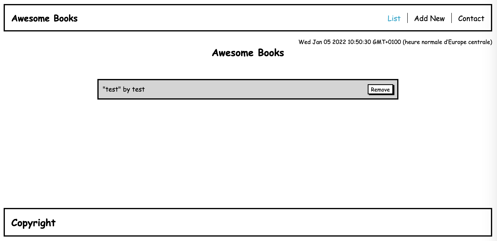

# Awesome books

> "Awesome books" is a simple website that displays a list of books and allows you to add and remove books from that list.

Additional description about the project and its features.

## Built With

- HTML
- CSS
- JAVASCRIPT

## Live Demo

[Live Demo Link](https://jihaneh.github.io/AwesomeBooksModule/)

## Getting Started

Download the project, unzip it and open index.html file in the browser

## Authors

👤 **Ahmed TA**

- GitHub: [@ahmedtaa](https://github.com/ahmedtaa)
- Twitter: [@\_ahmedta](https://twitter.com/_ahmedta)
- LinkedIn: [Ahmed](https://www.linkedin.com/in/ahmed-el-rakhawy-822ba225/)

👤 **Samuel Chimfwembe**

- GitHub: [@Mwapsam](https://github.com/Mwapsam)
- Twitter: [@Mwapsam](https://github.com/Mwapsam)
- LinkedIn: [Samuel](https://www.linkedin.com/in/mwape-samuel-09a688110/)

👤 **JihaneH**

- GitHub: [@jihaneH](https://github.com/jihaneH)
- Twitter: [@jijihaddad](https://twitter.com/jijihaddad)
- LinkedIn: [LinkedIn](https://linkedin.com/in/jihane-haddad/)

## 🤝 Contributing

Contributions, issues, and feature requests are welcome!

Feel free to check the [issues page](../../issues/).

## Show your support

Give a ⭐️ if you like this project!

## 📝 License

This project is [MIT](./MIT.md) licensed.
